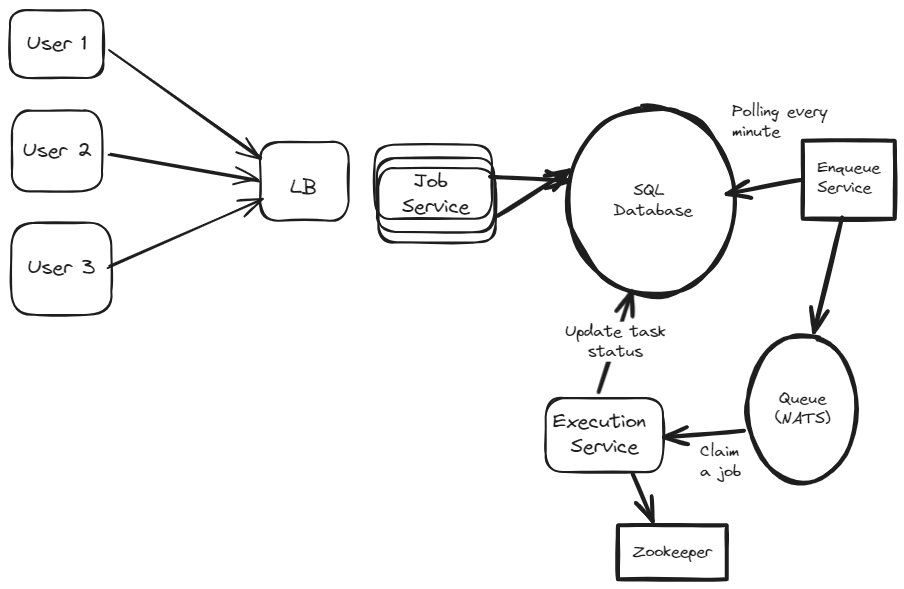

# Job Scheduler System Design

## Problem Statement
Design a job scheduler that runs jobs at scheduled interval one-off or regularly.
For this project scope, a Job is a CI/CD build and test project.

## Requirement
### Functional requirements

* User can submit a job or view a job
* User can see history of execution of all submitted jobs
* Jobs can have priority
* Job output shall be stored in the filestorage
* Job must be run at least once

### Non Functional requirement
* Scalable
* Highly available
* Reliability : job should run at least once and a job shall not be executed twice at the same time
* Durable : jobs information shall not be lost
* Security : Job execution shall be isolated


## Design

The system is configured to perform task as early as possible, with a resolution of a minute.
The output of the execution are stored in cloud storage, S3. The jobs will executed inside a docker container to provide isolation.

### API routes
- /api/v1/login : POST, login is handled with auth0.
- /api/v1/submit_job : POST, data is a yaml file
- /api/v1/retrieve_history_execution/job_id : GET, retrieve json history of execution
- /api/v1/last_execution_logs/job_id
- /api/v1/job_status/job_id

### Database Design

For retrieve operations. Given a user_id, retrieve user_jobs, all scheduled_tasks to be executed.
For update operations, user can create/delete jobs, update job's next execution timestamp. a service can update the task status.
We have read and write.
To execute tasks at the scheduled time, we need a (fast) to retrieve all jobs to be executed in the current time window.
A noSQL database might perform better here at high scale, however, i think a PostgresSQL will also perform well for a general use case.
It is also faster to setup and a lot of developers have the know-how.

Job table : to store generic job information

user_id | job_id | is_recurring | schedule | created_time
909     | 143214 | true         | 1h30m    | 2024-02-24T21:09:02

Job schedule : to store next job execution status

job_id | next_execution_time
143214 | 2024-02-24T21:09

An index on next_execution_time to allow fast retrieval.
Request would look like 
select * from job_schedule where next_execution_time = '2024-02-24T21:09'
At high scale, even with the index,  this query might be slow

Look at the next_execution_time, it might be useful to shard the DB on execution_time to reduce the range of scan.
It might also be worth to take a look at a NoSQL, i.e Cassandra.

Job execution history
job_id | execution_time | status | last_update_time | logs_path | execution_time

Services : 

Job Service : 
Receive clients job request and store them inside the DB.

Enqueue service : 
Poll the DB every minute and push to the jobs to a queue.
We are going to use NATS message broker. Kafka would also do it.

## Main Workflow
When a user create job, it will hit the job_service REST endpoint through the LB. the job_service will create the job inside the DB, compute the next execution time.
Data is provided using a yaml format. Ret value is 201 with job_id.
The scheduling service polls the job schedule DB every minute for pending jobs. The jobs are pushed to the NATS queue. Update job_execution_history to schedule and compute next_execution_time.
The execution service retrieves a job from the queue, and execute it. It then updates the status on the DB. The output of the execution is stored on S3.



### Notes
A job is a go package that is build and test, The client will submit the job via an API call with yaml spec (i.e url, task (build, test), format, ) and the output will be store in s3.

Only working on the backend. 
Going with these tech stack : 
Go(echo), Docker API, AWS RDS (postgres), DynamoDB, S3
For authentification, let's do auth0


#### Authentification
Used Auth0 to implement login/logout. Nice experience to learn about Auth0.

#### Yaml file parsing

File template

* The schedule field follows a crontab like expression

```
<second> <minute> <hour> <day>
```


jobs:
  - name: BuildAndTest
    schedule: "0 0 * * *"  # Every day at midnight
    run_once: false         # Run multiple times
    steps:
      - name: Set up Go
        run: go mod

      - name: Build
        run: go build -v ./...

      - name: Test
        run: go test -v ./...

  - name: NightlyCleanup
    schedule: "0 2 * * *"  # Every day at 2 AM
    run_once: true          # Run only once
    steps:
      - name: Cleanup
        run: ./cleanup_script.sh